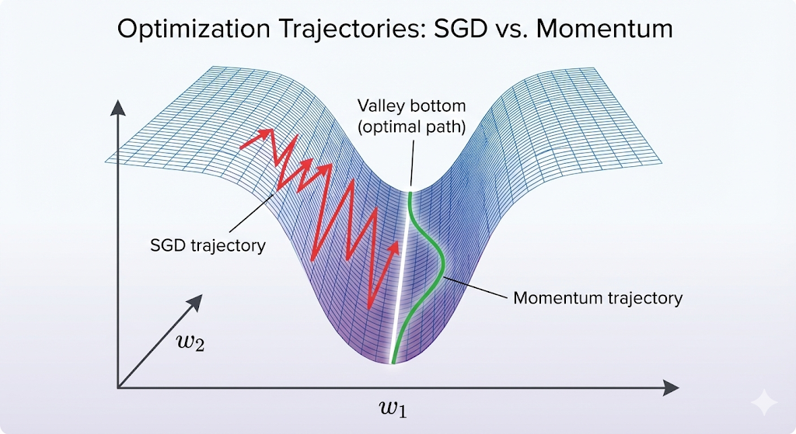
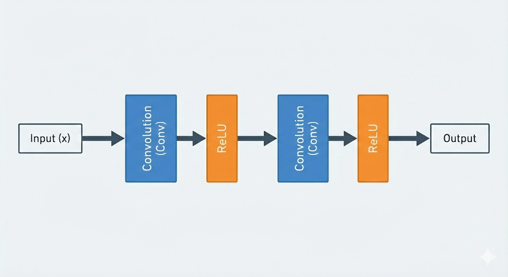
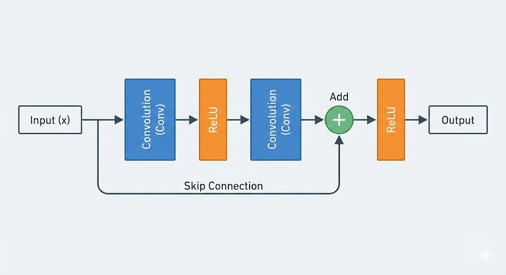

# Deep Learning Optimizers: A Complete Learning Journey

---

## Table of Contents

1. [Mathematical Foundations](#mathematical-foundations)
2. [Optimizer Deep Dive](#optimizer-deep-dive)
3. [Loss Landscape Intuition](#loss-landscape-intuition)
4. [Architecture Insights](#architecture-insights)
5. [Production Training](#production-training)
6. [Experimental Learnings](#experimental-learnings)
7. [Code Structure](#code-structure)

---

## Mathematical Foundations

### The Gradient: Direction of Steepest Ascent

**What is a gradient?**

For a function `L(w₁, w₂, ..., wₙ)` (loss with respect to weights), the gradient is:

```
∇L = [∂L/∂w₁, ∂L/∂w₂, ..., ∂L/∂wₙ]
```

**Geometric intuition:**

- The gradient points in the direction where the loss **increases fastest**
- To minimize loss, we go in the **opposite direction**: `w_new = w_old - η·∇L`
- In high dimensions (millions of weights), this is still just a direction vector

**Example:**

```
L(w₁, w₂) = w₁² + 10w₂²

∇L = [2w₁, 20w₂]

At point (4, 2): ∇L = [8, 40]
```

Notice: ∂L/∂w₂ is 5× larger than ∂L/∂w₁ because of the `10` multiplier. This creates a **ravine** - steep in one direction, shallow in another.

---

## Optimizer Deep Dive

### 1. Stochastic Gradient Descent (SGD)

**Update rule:**

```
w_{t+1} = w_t - η·∇L(w_t)
```

**What it does:**

- Computes gradient at current position
- Takes a step in the opposite direction
- Step size controlled by learning rate `η`

**Problems:**

1. **Ravines**: Oscillates across steep dimensions while slowly progressing along shallow ones
2. **Learning rate sensitivity**: Too large → diverges, too small → slow convergence
3. **Same learning rate for all parameters**: Some need big steps, others need small steps

**When it works:**

- With proper learning rate scheduling
- On relatively smooth loss landscapes
- When combined with careful tuning

**Mathematical insight:**

```
If landscape has different curvatures (like w₁² vs 10w₂²):
- Large gradients in steep directions cause oscillation
- Small gradients in shallow directions cause slow progress
```

---

### 2. Momentum

**Update rule:**

```
v_{t+1} = γ·v_t + η·∇L(w_t)
w_{t+1} = w_t - v_{t+1}
```

Where:

- `v` = velocity (accumulated past gradients)
- `γ` = momentum coefficient (typically 0.9)

**Physical analogy:**

- Rolling a ball down a hill
- Ball builds speed if gradient points consistently in same direction
- Ball has inertia that carries it through small bumps

**What it solves:**

1. **Accelerates in consistent directions**

   ```
   If gradient always points right:
   Step 1: v = 0.9(0) + 0.1·g = 0.1g
   Step 2: v = 0.9(0.1g) + 0.1·g = 0.19g
   Step 3: v = 0.9(0.19g) + 0.1·g = 0.271g
   → Velocity grows, accelerating descent
   ```

2. **Dampens oscillations**
   ```
   If gradient oscillates (left, right, left):
   Step 1: v = 0.1·g₁
   Step 2: v = 0.9(0.1g₁) + 0.1·(-g₂) = 0.09g₁ - 0.1g₂
   Step 3: v = 0.9(...) + 0.1·g₃
   → Oscillating gradients cancel out in velocity
   ```

**Mathematical intuition:**

```
v_t is an exponentially weighted moving average of gradients:
v_t = η·Σ(γⁱ·∇L_{t-i}) for i=0 to ∞

Recent gradients weighted more (γ⁰ = 1)
Old gradients weighted less (γ¹⁰ = 0.35 for γ=0.9)
```

**Why γ=0.9?**

- Higher (0.95): More smoothing, but slower to adapt to changes
- Lower (0.5): Less smoothing, closer to vanilla SGD
- 0.9 is empirical sweet spot for most problems

---

### 3. RMSProp (Root Mean Square Propagation)

**Update rule:**

```
s_t = β·s_{t-1} + (1-β)·∇L²
w_{t+1} = w_t - (η / √(s_t + ε))·∇L
```

Where:

- `s` = running average of squared gradients
- `β` = decay rate (typically 0.9)
- `ε` = small constant (1e-8) to prevent division by zero

**Key insight: Adaptive learning rates per parameter**

**Why square the gradients?**

```
Gradient magnitude matters, not direction:
- If gradient oscillates: [-40, +35, -42, +38]
  Squared: [1600, 1225, 1764, 1444]
  All positive → accumulates magnitude information

- Running average: s ≈ 1500
- Effective LR: η/√1500 ≈ η/39

vs parameter with small consistent gradients:
- Gradients: [2, 2.1, 1.9, 2.0]
  Squared: [4, 4.41, 3.61, 4]

- Running average: s ≈ 4
- Effective LR: η/√4 = η/2

Result: Large-gradient parameters get smaller effective LR
        Small-gradient parameters get larger effective LR
```

**What it solves:**

- **Automatic per-parameter learning rate adaptation**
- **Handles different scales without manual tuning**
- **Reduces oscillation in steep dimensions**

**Mathematical intuition:**

```
For parameter with high variance gradients:
→ Large s_t → Small effective learning rate → Careful updates

For parameter with low variance gradients:
→ Small s_t → Large effective learning rate → Aggressive updates
```

---

### 4. Adam (Adaptive Moment Estimation)

**The best of both worlds: Momentum + RMSProp**

**Update rule:**

```
m_t = β₁·m_{t-1} + (1-β₁)·∇L        # First moment (like momentum)
v_t = β₂·v_{t-1} + (1-β₂)·∇L²       # Second moment (like RMSProp)

m̂_t = m_t / (1 - β₁ᵗ)                # Bias correction
v̂_t = v_t / (1 - β₂ᵗ)                # Bias correction

w_{t+1} = w_t - η·m̂_t / (√v̂_t + ε)
```

Where:

- `β₁` = 0.9 (first moment decay)
- `β₂` = 0.999 (second moment decay)
- `t` = timestep

**Why bias correction?**

```
At t=1 (first step):
m₁ = 0.9(0) + 0.1·g = 0.1·g
v₁ = 0.999(0) + 0.001·g² = 0.001·g²

Without correction:
→ m₁ heavily biased toward zero (only 10% of gradient)
→ v₁ heavily biased toward zero (only 0.1% of gradient²)

With correction:
m̂₁ = 0.1·g / (1 - 0.9¹) = 0.1·g / 0.1 = g  ✓
v̂₁ = 0.001·g² / (1 - 0.999¹) = 0.001·g² / 0.001 = g²  ✓

As t → ∞:
(1 - β₁ᵗ) → 1, so correction fades away
```

**What Adam combines:**

1. **Momentum's acceleration** (via first moment `m`)
2. **RMSProp's adaptive scaling** (via second moment `v`)
3. **Bias correction** (for better early training)

**Why Adam became the default:**

- Works out of the box on most problems
- Robust to learning rate choice
- Handles different parameter scales automatically
- Doesn't require extensive tuning

**Trade-offs:**

- More memory (stores m and v for each parameter)
- Slightly more computation per step
- Can sometimes converge to worse solutions than well-tuned SGD

---

## Loss Landscape Intuition

### The Ravine Problem

**Simple bowl (symmetric):**

```
L(w₁, w₂) = w₁² + w₂²

Contours are circles
All directions have same curvature
SGD works fine
```

**Ravine (asymmetric):**

```
L(w₁, w₂) = w₁² + 10w₂²

Contours are ellipses (stretched)
Steep in w₂ direction, shallow in w₁
SGD oscillates across w₂, crawls along w₁
```

**Visualization:**



```
SGD trajectory: \/\/\/\  (zigzag)
Momentum:       \_____/  (smooth)
```

**Why momentum helps:**

```
Step 1: Gradient points down-left
        Velocity: v₁ = η·g₁

Step 2: Gradient points down-right (bouncing off wall)
        Velocity: v₂ = 0.9·v₁ + η·g₂
        → Left component from v₁ cancels right component from g₂
        → Net velocity: mostly downward along valley

Result: Smooth descent instead of zigzag
```

### Rosenbrock's Banana Valley

**Function:**

```
f(x, y) = (1-x)² + 100(y-x²)²
Minimum at (1, 1)
```

**Why it's hard:**

- Valley is curved (not straight like ravine)
- Very narrow (100× multiplier)
- Requires following the curve while descending

**Optimizer behavior:**

```
SGD with fixed LR:
- Can't follow the curve
- Overshoots and oscillates

Momentum with fixed LR:
- Builds speed but overshoots curves
- Flies out of valley

Adam/RMSProp:
- Adaptive rates help stay in valley
- But still needs good LR choice

Best solution: SGD with LR scheduling
- Start with large LR to explore
- Reduce LR to carefully follow curve
```

---

## Architecture Insights

### Batch Normalization

**Problem it solves: Internal Covariate Shift**

**Without BatchNorm:**

```
Epoch 1:
Conv1 outputs: range [-5, 5]
Conv2 learns to work with this range

Epoch 10:
Conv1 weights updated → outputs now [-50, 50]
Conv2 is confused (expected [-5, 5])
Must relearn with new distribution
```

**With BatchNorm:**

```
Every epoch:
Conv1 outputs → BatchNorm → normalized to ~[-1, 1]
Conv2 always sees consistent distribution
Learns faster, more stable
```

**Mathematical operation:**

```
Given batch of activations x:

1. Compute mean: μ = (1/m)·Σxᵢ
2. Compute variance: σ² = (1/m)·Σ(xᵢ - μ)²
3. Normalize: x̂ᵢ = (xᵢ - μ) / √(σ² + ε)
4. Scale and shift: yᵢ = γ·x̂ᵢ + β

Where γ, β are learnable parameters
```

**Why before ReLU?**

```
Option A: Conv → ReLU → BatchNorm
- ReLU zeros out negatives first
- Normalizing a clipped distribution (half zeros)
- Less stable

Option B: Conv → BatchNorm → ReLU  ✓
- Normalize the full distribution from Conv
- Then apply ReLU to normalized values
- More stable, better gradient flow
```

**Effect on training:**

- Higher learning rates possible (2-10× larger)
- Faster convergence (fewer epochs)
- Less sensitive to initialization
- Acts as regularization (slight noise from batch statistics)

---

### Skip Connections (ResNets)

**The Degradation Problem:**

```
Network depth vs accuracy:

3 layers:  84% ✓
6 layers:  85% ✓
12 layers: 83% ✗ (worse!)
20 layers: 78% ✗✗ (much worse!)

This is on TRAINING data!
Not overfitting - the deeper network CAN'T EVEN FIT the training data
```

**Why naive deep networks fail:**

**Vanishing gradients:**

```
Chain rule for 20 layers:
∂L/∂w₁ = ∂L/∂w₂₀ · ∂w₂₀/∂w₁₉ · ... · ∂w₂/∂w₁

If each ∂wᵢ/∂wᵢ₋₁ < 1 (e.g., 0.5):
∂L/∂w₁ ≈ 0.5²⁰ ≈ 10⁻⁶

Gradient vanishes → early layers don't learn
```

**Exploding gradients:**

```
If each ∂wᵢ/∂wᵢ₋₁ > 1 (e.g., 2.0):
∂L/∂w₁ ≈ 2²⁰ ≈ 10⁶

Gradient explodes → unstable training
```

**ResNet's solution: Skip connections**

**Standard block:**



**Residual block:**



```

**Mathematical magic:**

```

Instead of learning: F(x)
Learn the residual: F(x) = H(x) - x

So: H(x) = F(x) + x

During backprop:
∂H/∂x = ∂F/∂x + 1

That "+1" is the key!
Gradient always has a path that's just "1"
→ Doesn't vanish through skip connection

```

**Why it works:**

```

20 layers of ResNet blocks:

Gradient flow:
∂L/∂x₁ = (∂F₂₀/∂x₂₀ + 1)·(∂F₁₉/∂x₁₉ + 1)·...·(∂F₁/∂x₁ + 1)

Even if all ∂Fᵢ/∂xᵢ vanish:
∂L/∂x₁ ≈ 1·1·...·1 = 1

Gradient highway: always has a clear path backward

```

**ResNet depths:**

- ResNet-20: [3,3,3] blocks = 3·3·2 + 2 = 20 layers
- ResNet-56: [9,9,9] blocks = 9·3·2 + 2 = 56 layers
- ResNet-110: [18,18,18] blocks = 110 layers

Deeper = more capacity = better representations (if trained properly)

---

## Production Training

### Learning Rate Scheduling

**Why schedule learning rate?**

**Fixed LR problems:**

```

Early training (epoch 1-60):

- Weights far from optimum
- Need large steps to explore
- Fixed LR=0.1 works well

Late training (epoch 120-160):

- Weights close to optimum
- Large steps overshoot
- Fixed LR=0.1 causes oscillation

```

**Solution: Start large, decay over time**

**Step decay:**

```

epochs 0-60: lr = 0.1 (exploration)
epochs 60-120: lr = 0.01 (refinement)
epochs 120+: lr = 0.001 (fine-tuning)

```

**Why it works:**

```

Driving analogy:

- Highway (epoch 0-60): Drive fast (lr=0.1)
- Neighborhood (60-120): Slow down (lr=0.01)
- Driveway (120+): Crawl (lr=0.001)

Each phase needs different speed

```

**Cosine decay:**

```

lr(t) = lr_max · 0.5 · (1 + cos(π·t/T))

Smooth continuous decay
Often works slightly better than step decay

```

### Warmup

**The cold start problem:**

```

Epoch 0:

- Weights are random
- Gradients are huge and chaotic
- Large LR causes wild updates

Result: Training instability or divergence

```

**Warmup solution:**

```

Gradually increase LR from 0 to base_lr over first 5 epochs:

Epoch 0: lr = base_lr · (1/5) = 0.02 (if base_lr=0.1)
Epoch 1: lr = base_lr · (2/5) = 0.04
Epoch 2: lr = base_lr · (3/5) = 0.06
Epoch 3: lr = base_lr · (4/5) = 0.08
Epoch 4: lr = base_lr · (5/5) = 0.10
Epoch 5+: Regular schedule kicks in

```

**Why it helps:**

- Model "settles" with small safe updates
- Avoids early instability
- Especially critical for large learning rates (0.1+)

### Weight Decay

**What is it?**

```

Standard update:
w_new = w_old - lr·∇L

With weight decay:
w_new = w_old - lr·(∇L + λ·w_old)
= (1 - lr·λ)·w_old - lr·∇L

```

**Effect:**

- Multiplies weights by `(1 - lr·λ)` each step
- Shrinks weights toward zero
- `λ` = weight decay coefficient (typically 5e-4)

**Why it helps (regularization):**

```

Large weights → model is sensitive to small input changes → overfitting
Small weights → model is more robust → better generalization

Weight decay prefers solutions with smaller weights

```

**Mathematical view (L2 regularization):**

```

Standard loss: L(w)
With L2 penalty: L(w) + (λ/2)·||w||²

Gradient: ∇L + λ·w

Adding weight decay to gradient is equivalent to L2 regularization

```

**Typical value: λ = 5e-4 for CIFAR-10**

### Gradient Clipping

**Problem: Exploding gradients**

```

Deep networks or RNNs can have:
∇L with ||∇L|| = 10,000

Update: w_new = w - 0.1·∇L
→ changes weights by -1000!
→ Complete chaos

```

**Solution: Clip gradient norm**

```

if ||∇L|| > max_norm:
∇L = (max_norm / ||∇L||) · ∇L

Example with max_norm=1.0:
Original: ||∇L|| = 10,000
Clipped: ∇L_clipped = (1.0/10000)·∇L
||∇L_clipped|| = 1.0

```

**What it does:**

- Preserves gradient direction
- Limits gradient magnitude
- Prevents catastrophic updates

**When it's critical:**

- Very deep networks (100+ layers)
- Recurrent networks (LSTM, GRU)
- Training with large learning rates

**Typical value: max_norm = 1.0**

### Data Augmentation

**Purpose: Prevent overfitting through artificial variety**

**Without augmentation:**

```

Model sees same image every epoch:
Epoch 1: Cat at center, facing right
Epoch 2: Same cat image
Epoch 100: Same cat image

Model memorizes: "cat = this specific pixel pattern"
Test image slightly different → fails

```

**With augmentation:**

```

Model sees different version every epoch:
Epoch 1: Cat at center
Epoch 2: Cat shifted left
Epoch 3: Cat flipped horizontally
Epoch 100: Cat with color jitter

Model learns: "cat = these general features" (ears, whiskers, etc.)
More robust to variations

````

**CIFAR-10 augmentations:**

```python
transforms.RandomCrop(32, padding=4)  # Shift image up to 4 pixels
transforms.RandomHorizontalFlip()      # 50% chance flip left-right
transforms.ColorJitter(...)            # Slight color variations
````

**Why padding=4 for 32×32 images?**

```
1. Pad image: 32×32 → 40×40 (add 4 pixels each side)
2. Random crop: Extract 32×32 patch from 40×40
3. Result: Image can shift ±4 pixels in any direction

Empirically found sweet spot:
- padding=2: Not enough variation
- padding=8: Too aggressive, loses information
- padding=4: Just right for 32×32 images
```

**Effect on training:**

```
Train accuracy: LOWER (model sees harder variations)
Test accuracy: HIGHER (model generalizes better)
Train/test gap: SMALLER (less overfitting)

Example:
No augment:  Train 97% / Test 73% (gap: 24%)
With augment: Train 82% / Test 80% (gap: 2%)
```

---

## Experimental Learnings

### Sanity Checks (Critical before full training)

**1. Single batch overfit test**

```
Goal: Can model memorize 16 images?

If YES (reaches 95%+ in 50-100 steps):
✓ Model has capacity
✓ Optimizer works
✓ Learning rate in reasonable range
✓ Backprop flowing correctly

If NO (stuck at random):
✗ Bug in architecture
✗ Optimizer broken
✗ Learning rate too small
✗ Gradients not flowing
```

**2. Gradient flow check**

```
Run one forward+backward pass
Check gradient norms for each layer

Healthy:
conv1.weight: grad_norm = 0.23
conv2.weight: grad_norm = 0.45
fc.weight:    grad_norm = 0.31

Unhealthy:
conv1.weight: grad_norm = 0.0  ✗ (dead layer)
conv2.weight: grad_norm = 1000 ✗ (exploding)
```

**3. Loss behavior check**

```
Train for 20-50 batches, watch loss:

Good: 2.3 → 1.8 → 1.3 → 0.9 (decreasing)
Bad:  2.3 → 5.6 → NaN (exploding)
Bad:  2.3 → 2.3 → 2.3 (stuck)
```

**Run sanity checks in < 5 minutes, save hours of debugging**

### CIFAR-10 Results Summary

**CNN Baseline (3 conv layers):**

```
No augmentation, fixed LR:     72.9%
With augmentation:             79.6%
With augmentation + LR sched:  83.9%
```

**ResNet-20:**

```
SGD, LR scheduling:            ~91%
Adam, fixed LR:                ~89%
```

**Key insights:**

- Data augmentation: +7% boost
- LR scheduling: +4% boost
- Skip connections: +7% boost over CNN
- Batch norm: Included in all, critical for deep networks

### Optimizer Comparison on CIFAR-10

**After 20 epochs (lr=0.001, no scheduling):**

```
SGD:      11.8%  (stuck, LR too small)
Momentum: 51.3%  (better, but still slow)
RMSProp:  73.4%  (adaptive LR helps)
Adam:     74.9%  (best out-of-box)
```

**Key observation:**
Adam works "out of the box" because adaptive LR compensates for suboptimal base LR choice.

**After 200 epochs (SGD with LR scheduling):**

```
SGD with schedule: 83.9%  (beats Adam!)
Adam fixed LR:     82.5%
```

**Key observation:**
Well-tuned SGD often beats Adam in final performance, but requires more effort.

### Learning Rate Experiments

**SGD on Rosenbrock function:**

```
lr=0.001: Stuck at 80%, slow progress
lr=0.01:  Explodes to NaN (too aggressive)

With scheduling (0.1 → 0.01 → 0.001):
Reaches optimum smoothly
```

**Insight:**
Single LR can't handle both exploration (early) and refinement (late).

### Gradient Norm Observations

**During training:**

```
Epoch 0-60 (lr=0.1):
- Gradient norms: 2.0-2.5 (high, aggressive updates)
- Loss drops fast
- Test accuracy climbs to ~80%

Epoch 60-120 (lr=0.01):
- Gradient norms: 1.5-1.8 (moderate)
- Loss decreases slowly
- Test accuracy: 80% → 83%

Epoch 120+ (lr=0.001):
- Gradient norms: 1.2-1.5 (small, careful)
- Loss barely changes
- Test accuracy: 83% → 83.8% (fine-tuning)
```

**Pattern:**
Gradient norms track with learning rate. When LR drops, gradients become smaller (more careful updates).

---

## Code Structure

### Clean Architecture Principles

**Separation of concerns:**

```
models/     - Architecture definitions only
optimizers/ - Optimization algorithms only
data/       - Data loading only
utils/      - Helper functions (checkpoint, logging, metrics)
```

**Config-driven experiments:**

```python
# Change hyperparameters without touching code
config = Config(
    model="resnet56",
    batch_size=512,
    base_lr=0.1
)
```

**Factory patterns:**

```python
# Get any model by name
model = get_model("resnet20")

# Get any config by name
config = get_config("resnet56_aggressive")
```

### Key Design Decisions

**1. Why separate core optimizers from PyTorch wrapper?**

```
optimizers/core.py:     Pure numpy, pedagogical
optimizers/wrapper.py:  PyTorch integration

Benefits:
- Core algorithms are readable
- Can test optimizers on toy functions
- Wrapper handles PyTorch details (device, dtype, etc.)
```

**2. Why use state dict for checkpointing?**

```
Problem: Parameter IDs (id(p)) change between sessions
Solution: Save state by parameter INDEX, not by ID

save:    state_dict[0] = momentum_buffer_for_param_0
load:    restore state_dict[0] to current param_0
```

**3. Why Trainer class instead of functions?**

```
Encapsulation:
- All training state in one object
- Easy to pause/resume
- Clean interface for experiments

Alternative (functional):
- Passing 10+ arguments to every function
- Global state management
- Hard to extend
```

### Production Features

**Checkpointing:**

```python
checkpoint = {
    'epoch': 87,
    'model_state_dict': model.state_dict(),
    'optimizer_state_dict': optimizer.state_dict(),  # Critical!
    'best_acc': 85.3,
    'config': config,
    'rng_state': torch.get_rng_state()  # Reproducibility
}
```

**TensorBoard logging:**

```python
logger.log_scalar('train/loss', loss, epoch)
logger.log_scalar('train/acc', acc, epoch)
logger.log_scalar('lr', learning_rate, epoch)

# View: tensorboard --logdir logs/
```

**Reproducibility:**

```python
torch.manual_seed(42)
torch.cuda.manual_seed(42)
# Plus save/load RNG state in checkpoints
```

---

## Key Takeaways

### Mathematical Intuition

1. **Gradients are directions in loss landscape**

   - Point uphill, we go downhill
   - In high dimensions, still just a vector

2. **Momentum = exponentially weighted moving average of gradients**

   - Builds velocity in consistent directions
   - Damps oscillations in conflicting directions

3. **Adaptive LR = per-parameter learning rate scaling**

   - Large gradient history → small effective LR
   - Small gradient history → large effective LR

4. **Skip connections = gradient highways**

   - Provide path with derivative = 1
   - Prevent vanishing gradients in deep networks

5. **Batch norm = normalize intermediate activations**
   - Makes training more stable
   - Allows larger learning rates

### Engineering Intuition

1. **Always run sanity checks before full training**

   - Single batch overfit (most important)
   - Gradient flow
   - Loss decrease over 20-50 batches

2. **Learning rate is the most important hyperparameter**

   - Too large → divergence
   - Too small → slow/stuck
   - Schedule it: explore → refine → fine-tune

3. **Data augmentation is cheap regularization**

   - 2-3 lines of code
   - 5-10% accuracy boost
   - Forces learning robust features

4. **Checkpointing is non-negotiable in production**

   - Save model state
   - Save optimizer state (don't forget this!)
   - Save config for reproducibility

5. **Adam is the safe default, but not always best**
   - Works out of box (robust to LR choice)
   - Well-tuned SGD often achieves better final accuracy
   - Use Adam to prototype, consider SGD for final tuning

### Architecture Intuition

1. **Deeper is better (with skip connections)**

   - ResNet-20 < ResNet-56 < ResNet-110
   - Without skip connections, deeper is worse

2. **Batch norm goes before ReLU**

   - Normalize full distribution
   - Then apply non-linearity

3. **Skip connections add before final ReLU**
   - Gradient flows through addition unchanged
   - Then through ReLU

### Debugging Intuition

1. **If model won't learn (stuck at random):**

   - Check gradient flow (any zeros?)
   - Try larger learning rate
   - Verify loss function is correct

2. **If training is unstable (loss spikes):**

   - Reduce learning rate
   - Add gradient clipping
   - Check for data issues (NaN, inf)

3. **If overfitting (train >> test):**

   - Add data augmentation
   - Increase weight decay
   - Train less epochs (early stopping)

4. **If underfitting (both low):**
   - Increase model capacity
   - Train more epochs
   - Reduce regularization

---

## Mathematical Appendix

### Optimizer Update Rules (Complete)

**SGD:**

```
w_{t+1} = w_t - η·∇L(w_t)
```

**SGD with Momentum:**

```
v_{t+1} = γ·v_t + η·∇L(w_t)
w_{t+1} = w_t - v_{t+1}

Equivalent form:
v_{t+1} = γ·v_t + ∇L(w_t)
w_{t+1} = w_t - η·v_{t+1}
```

**Nesterov Momentum:**

```
v_{t+1} = γ·v_t + η·∇L(w_t - γ·v_t)  # Gradient at lookahead position
w_{t+1} = w_t - v_{t+1}
```

**RMSProp:**

```
s_t = β·s_{t-1} + (1-β)·[∇L(w_t)]²
w_{t+1} = w_t - (η / √(s_t + ε))·∇L(w_t)
```

**Adam:**

```
m_t = β₁·m_{t-1} + (1-β₁)·∇L(w_t)         # First moment
v_t = β₂·v_{t-1} + (1-β₂)·[∇L(w_t)]²      # Second moment

m̂_t = m_t / (1 - β₁ᵗ)                      # Bias correction
v̂_t = v_t / (1 - β₂ᵗ)

w_{t+1} = w_t - η·m̂_t / (√v̂_t + ε)
```

**AdamW (Adam with decoupled weight decay):**

```
m_t = β₁·m_{t-1} + (1-β₁)·∇L(w_t)
v_t = β₂·v_{t-1} + (1-β₂)·[∇L(w_t)]²

m̂_t = m_t / (1 - β₁ᵗ)
v̂_t = v_t / (1 - β₂ᵗ)

w_{t+1} = w_t - η·m̂_t/(√v̂_t + ε) - η·λ·w_t  # λ is weight decay
```

### Typical Hyperparameters

**SGD:**

```
η (learning rate): 0.1 with scheduling
                   0.01 without scheduling
γ (momentum):      0.9 (if using momentum variant)
```

**Adam:**

```
η (learning rate): 0.001 (robust default)
β₁:                0.9
β₂:                0.999
ε:                 1e-8
```

**Training:**

```
Batch size:        128-512 (depends on GPU memory)
Weight decay:      5e-4 (CIFAR-10), 1e-4 (ImageNet)
Grad clip:         1.0 (for deep networks)
Warmup epochs:     5
```

**LR Schedule (CIFAR-10, 200 epochs):**

```
Epochs 0-5:    Warmup: 0 → 0.1
Epochs 5-100:  lr = 0.1
Epochs 100-150: lr = 0.01
Epochs 150-200: lr = 0.001
```

### Gradient Computation Examples

**Simple function:**

```
L(w) = w²

∇L = 2w

At w=3: ∇L = 6
Update (η=0.1): w_new = 3 - 0.1·6 = 2.4
```

**Multi-parameter:**

```
L(w₁, w₂) = w₁² + 10w₂²

∇L = [∂L/∂w₁, ∂L/∂w₂] = [2w₁, 20w₂]

At (w₁=4, w₂=2): ∇L = [8, 40]
Update (η=0.1):
  w₁_new = 4 - 0.1·8 = 3.2
  w₂_new = 2 - 0.1·40 = -2.0  # Overshot! (oscillation)
```

**Neural network layer:**

```
Forward: y = W·x + b
Loss: L = (y - target)²

∂L/∂W = ∂L/∂y · ∂y/∂W
      = 2(y - target) · x^T

∂L/∂b = ∂L/∂y · ∂y/∂b
      = 2(y - target)

This is backpropagation!
```

> Explanations adapted from various deep learning resources and personal experience in training neural networks. Images and other textual elements are generated through AI assistance.
